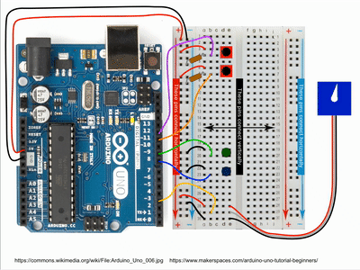

ArduinoSim - Arduino Simulator
==============================

https://www.staff.ncl.ac.uk/francisfranklin/arduino-lab/

## Overview

**ArduinoSim** is a Python simulation of an Arduino Uno connected to two switches, two LEDs and a servo motor. It provides an easy way to learn how to multi-task, and was written with the following exercise in mind:

1. When the top button is pressed, the green LED should blink;
2. When the bottom button is pressed, the blue LED should blink;
3. When both buttons are pressed, the green and blue LEDS should alternate; and
4. Meanwhile, the servo should be sweeping back and forth smoothly across 180 degrees.

<a href="images/Demo-800x600.gif"></a>
_(Click to Enlarge)_

## Python

The following two files should be in your Python working folder (e.g., `H:\\Python`):

- ArduinoSim.py
- ArduinoSim.png

Do **not** edit these. You will need to create a third file - you can use _example.py_ as a template - in the same folder.

**Note**: The simulation is written for **Python 3**, and the Python module **matplotlib** must be installed.

When you start the Python application and command window (e.g., IDLE, or IDLEX if you have it), you will need to set the working directory:
```python
import os
os.chdir('H:\\Python')
```

As with the Arduino, `setup()` runs once at the beginning, and then `loop()` is run repeatedly.

The methods available for controlling the Arduino are:

### `delay(ms)`
Pause execution for *ms* milliseconds.
### `digitalRead(number)`
Returns the current value of pin _number_ as either HIGH or LOW. Note: The pin should be set as an INPUT.
### `digitalWrite(number, state)`
Sets the current value of pin _number_ as _state_, where _state_ is either HIGH or LOW. Note: The pin should be set as an OUTPUT.
### `micros()`
Returns the number of microseconds since program started.
### `millis()`
Returns the number of milliseconds since program started.
### `pinMode(number, mode)`
Specify that pin _number_ should be used as an input (if _mode_ is INPUT) or as an output (if _mode_ is OUTPUT). Note: _number_ is an integer in the range 0-13.

In addition, a servo controller can be created using, e.g.:
```python
myServo = Servo()
```
and this has the usual Servo methods, most importantly:
### `myServo.attach(number)`
Attach the servo controller to pin _number_.
### `myServo.write(angle)`
Set the servo to position _angle_, where 0 <= _angle_ <= 180.

--------

## License

Unless otherwise stated, the code and examples here are
provided under the MIT License:

Copyright (c) 2020 Francis James Franklin

Permission is hereby granted, free of charge, to any person
obtaining a copy of this software and associated
documentation files (the "Software"), to deal in the
Software without restriction, including without limitation
the rights to use, copy, modify, merge, publish,
distribute, sublicense, and/or sell copies of the Software,
and to permit persons to whom the Software is furnished to
do so, subject to the following conditions:

The above copyright notice and this permission notice shall
be included in all copies or substantial portions of the
Software.

THE SOFTWARE IS PROVIDED "AS IS", WITHOUT WARRANTY OF ANY
KIND, EXPRESS OR IMPLIED, INCLUDING BUT NOT LIMITED TO THE
WARRANTIES OF MERCHANTABILITY, FITNESS FOR A PARTICULAR
PURPOSE AND NONINFRINGEMENT. IN NO EVENT SHALL THE AUTHORS
OR COPYRIGHT HOLDERS BE LIABLE FOR ANY CLAIM, DAMAGES OR
OTHER LIABILITY, WHETHER IN AN ACTION OF CONTRACT, TORT OR
OTHERWISE, ARISING FROM, OUT OF OR IN CONNECTION WITH THE
SOFTWARE OR THE USE OR OTHER DEALINGS IN THE SOFTWARE.
