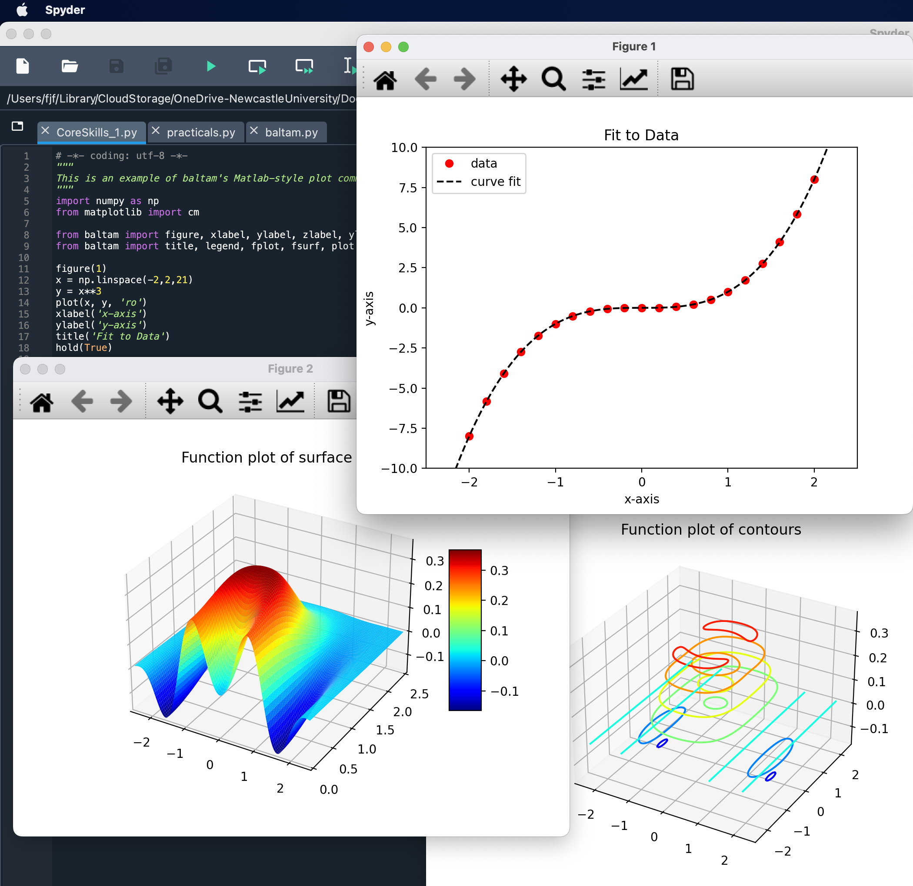

baltam - Matlab plotting functions for Python beginners
=======================================================

## Overview

Matlab has a very simple set of commands for creating a variety of figures, and although Python's MatPlotLib these days has much of the same functionality, if not more, the class structure that needs to be understood can be a little intimidating. If the goal is to produce simple plots of functions and data, it's convenient to have some short cuts that don't require diving deep into Python.

`baltam.py` provides a few convenient functions that should not be treated as a permanent alternative to learning the various Python libraries such as SciPy and MatPlotLib. `practicals.py` gives a set of solutions to some Matlab practicals as an illustration of how to use baltam - and also its limitations.

## baltam

The simplest way to use these functions is just to include everything:
```python
from baltam import *
```
although if you are using Spyder (for example) it will complain about using functions that aren't clearly defined.

The functions defined in `baltam.py` are:

### `answer(number)`
A simple way to print a number to three significant figures, with options for the number of significant figures, to layout as a matrix, and a tolerance for zero (defaulting to 1E-15).
```
In [52]: answer(1/3)
answer (3 s.f.): 0.333

In [53]: answer(1j/3, sigfigs=5)
answer (5 s.f.): 0 + 0.33333i

In [54]: answer(np.asarray([[1,1j],[2,2j]]), style='matrix')
answer (3 s.f.):  (          1 +          0i) (          0 +          1i)
                  (          2 +          0i) (          0 +          2i)

In [55]: answer(0.001**5)
answer (3 s.f.): 0

In [56]: answer(0.001**5, zero=1E-16)
answer (3 s.f.): 1e-15
```
### `csvread(filename, skip_rows=0, skip_cols=0)`
Reads the named comma-separated variable (CSV) file, starting at row zero and column zero unless specified otherwise, e.g.:
```Python
data = csvread('accel_Dec0910_153854.csv', 1, 0)
```
### `ode(fn, from_to, y0)`
An ordinary differential equation solver, where `fn` is a function f(t,y) returning dy/dt; `from_to` is a list ([t1, t2] or [t1, ..., t2]) specifying the time-span of integration; and `y0` is the initial value to match `fn`, e.g.:
```Python
def dzdn(n, z):
    return np.asarray([z[0] - z[1], z[0] + z[1]])

N, Z = ode(dzdn, [0.5,1.5], [0.5,-0.5])
```
### Plotting Functions
`baltam.py` is designed to mimic Matlab's plotting functions closely, so `figure()` opens a new plot window and, e.g., `figure(3)` creates or returns to the window titled Figure 3. By default, each new plot overwrites any existing plot, but specifying `hold(True)` changes this behaviour. (Changing between 2D and 3D plots always overwrites any existing plot.) Specifying `hold(False)` returns to the default behaviour.

Titles and axis labels can be set with, e.g., `title('This is the title')` and `xlabel('This is the x axis')` and so on. For 2D line plots, a legend can be added using a list of descriptions, e.g., `legend(['Line 1','Line 2'])`. Axis ranges can be set with `xlim([from,to])`, etc., and `gca()` returns the MatPlotLib axes object (if needed).

Various plots can be created with functions matching their Matlab equivalents: `fplot()`, `fsurf()`, `surface()`, `contour()`, `plot()`, `plot3()`. A MatPlotLib colormap can be given as an option to `fsurf()`, `surface()`, `contour()`, and `fsurf()` can be used to create several types of 3D plot (by specifying the option plot_type as 'surf', 'surfc', 'cont2d' or 'cont3d').

```Python
import numpy as np
from matplotlib import cm

from baltam import figure, xlabel, ylabel, zlabel, ylim, hold
from baltam import title, legend, fplot, fsurf, plot

figure(1)
x = np.linspace(-2,2,21)
y = x**3
plot(x, y, 'ro')
xlabel('x-axis')
ylabel('y-axis')
title('Fit to Data')
hold(True)

def cube(x):
    return x**3
fplot(cube, [-2.5,2.5], 'k--')
legend(['data','curve fit'])
ylim([-10,10])
hold(False)

def dimple(x, y):
    radius_squared = x**2 + y**2
    return np.cos(x**2) * radius_squared * np.exp(-radius_squared)

figure(2)
fsurf(dimple, [-2.5,2.5,0,2.5], resolution=(141,71), cmap=cm.jet)
title('Function plot of surface')
zlabel('z')

figure(3)
fsurf(dimple, [-2.5,2.5,-2.5,2.5], resolution=(141,71), cmap=cm.jet, plot_type='cont3d')
title('Function plot of contours')
```



--------

## License

Unless otherwise stated, the code and examples here are
provided under the MIT License:

Copyright (c) 2020-23 Francis James Franklin

Permission is hereby granted, free of charge, to any person
obtaining a copy of this software and associated
documentation files (the "Software"), to deal in the
Software without restriction, including without limitation
the rights to use, copy, modify, merge, publish,
distribute, sublicense, and/or sell copies of the Software,
and to permit persons to whom the Software is furnished to
do so, subject to the following conditions:

The above copyright notice and this permission notice shall
be included in all copies or substantial portions of the
Software.

THE SOFTWARE IS PROVIDED "AS IS", WITHOUT WARRANTY OF ANY
KIND, EXPRESS OR IMPLIED, INCLUDING BUT NOT LIMITED TO THE
WARRANTIES OF MERCHANTABILITY, FITNESS FOR A PARTICULAR
PURPOSE AND NONINFRINGEMENT. IN NO EVENT SHALL THE AUTHORS
OR COPYRIGHT HOLDERS BE LIABLE FOR ANY CLAIM, DAMAGES OR
OTHER LIABILITY, WHETHER IN AN ACTION OF CONTRACT, TORT OR
OTHERWISE, ARISING FROM, OUT OF OR IN CONNECTION WITH THE
SOFTWARE OR THE USE OR OTHER DEALINGS IN THE SOFTWARE.
