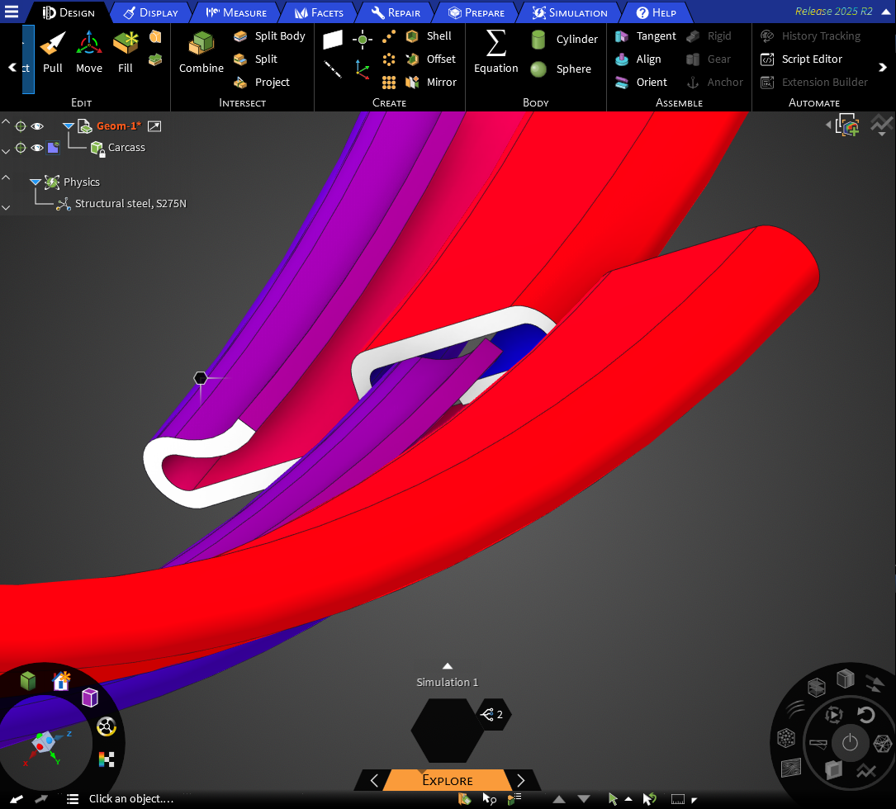

# sketch
Python code for drawing tangent paths in Discovery (previously SpaceClaim) or MatPlotLib

A number of things changed subtly between SpaceClaim v22 and Discovery v252, but I'm gradually getting the code working again. Here's a carcass (based on schematic and measures in Tang et al.) modelled in Discovery 2025 R2.

Left: Straight lines intersecting with optional transition radius. Right: Curved transitions between arcs.

The same, sketched in SpaceClaim, with automatic detection of closed loops to form surfaces.

Various curved transitions between straight lines and circular arcs.

The same, sketched in SpaceClaim...

... with automatic detection of closed loops to form surfaces.

Outline of a hook using lines, arcs and transitions:

The hook extruded...

... with named selections.

It's possible to offset whole paths:

and to use <a href="https://github.com/nschloe/dmsh">dmsh</a> and <a href="https://github.com/nschloe/optimesh">optimesh</a> to generate meshes:

