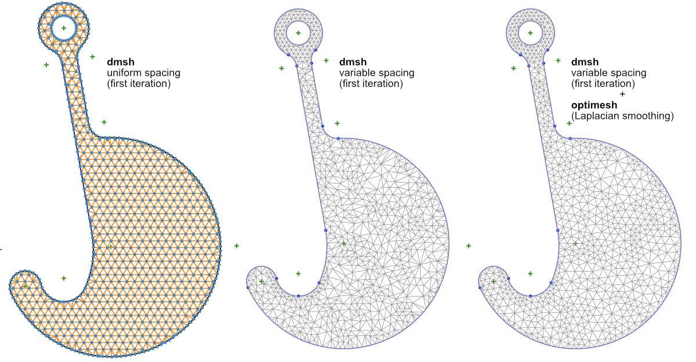

# sketch
Python code for drawing tangent paths in SpaceClaim or MatPlotLib

Left: Straight lines intersecting with optional transition radius. Right: Curved transitions between arcs.

The same, sketched in SpaceClaim, with automatic detection of closed loops to form surfaces.

Various curved transitions between straight lines and circular arcs.

The same, sketched in SpaceClaim...

... with automatic detection of closed loops to form surfaces.

Outline of a hook using lines, arcs and transitions:

The hook extruded...

... with named selections.

It's possible to offset whole paths:

and to use <a href="https://github.com/nschloe/dmsh">dmsh</a> to generate meshes:

